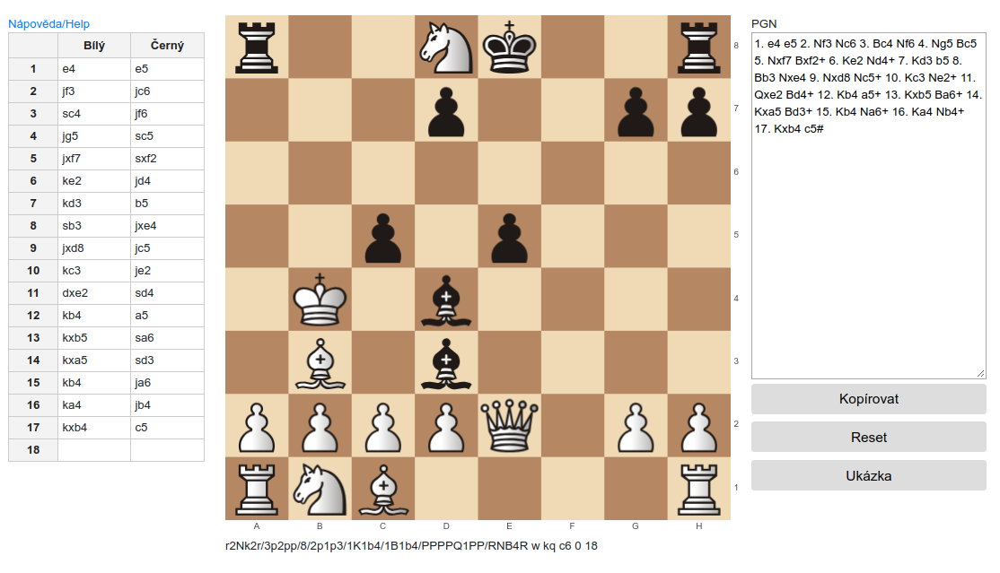

# Chess sheet



## Demo

[https://partiar.skybit.cz](https://partiar.skybit.cz)

## Goal

The goal of application is to make the chess sheet transcription faster and easier.

## Features

- accepts moves in standard notation and in czech case-insensitive notation
- visualises the last position on the chessboard
- converts the input to PGN notation
- highlights invalid moves

# Partiář

## Cíl

Cílem aplikace je zjednodušit a zrychlit přepis šachových partiářů do digitální podoby.

## Vlastnosti

- tahy mohou být zapisovány ve standardní a v české notaci, česká notace ignoruje velikost písmen u označení figur
- poslední pozice je zobrazena na šachovnici
- vstup je konvertován do stadardizované PGN notace
- nevalidní tahy jsou zvýrazněny

## Installation

Build the app
```
yarn
yarn build:production
```

The result is in _dist_ folder.

## 